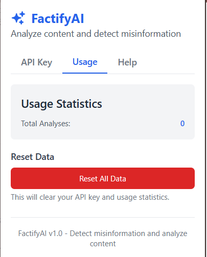
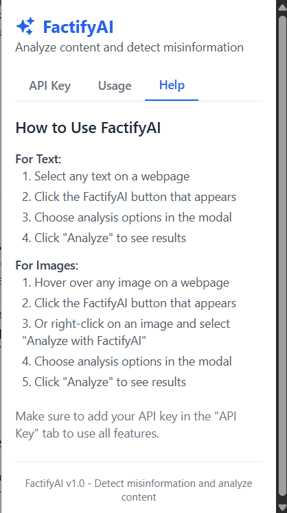

# FactifyAI - AI-powered Fact Checking Tool

FactifyAI is a comprehensive solution for fact-checking web content, consisting of a Chrome extension that analyzes text and images on any webpage, backed by a Spring Boot application that processes these requests using AI models.


## Project Structure

This project consists of two main components:

1. **Factify-extension** - A Chrome extension built with React, TypeScript, and Tailwind CSS
2. **FactifyBackend** - A Spring Boot application that serves as the API backend

## Features

- **Text Analysis**:
  - Fact checking of selected text
  - Bias detection
  - Related articles lookup
  - Similar discussions finder
  - Trusted alternatives
  - Explanation and summarization
  
- **Image Analysis**:
  - Authenticity verification
  - Image source lookup
  - Trusted alternative sources
  - Explanation and summarization



## Chrome Extension (Factify-extension)

The Chrome extension provides a user-friendly interface for selecting and analyzing content directly on webpages.

### Key Components

- **Floating UI**: Appears when text is selected or images are right-clicked
- **Analysis Modal**: Presents analysis options and results
- **Popup Interface**: For API key management and usage statistics

### Technology Stack

- React 19
- TypeScript
- Tailwind CSS
- Vite
- Chrome Extension API

### Directory Structure

```
Factify-extension/
│
├── src/
│   ├── content/            # Content scripts
│   │   ├── index.tsx       # Content script entry point
│   │   ├── FloatingUI.tsx  # Floating bubble UI
│   │   └── AnalysisModal.tsx # Analysis results modal
│   ├── popup/              # Extension popup
│   │   ├── index.html      # Popup HTML
│   │   └── Popup.tsx       # Popup component
│   ├── background/         # Background service worker
│   │   └── background.ts   # Background script
│   ├── utils/              # Shared utilities
│   │   ├── api.ts          # API service
│   │   └── types.ts        # TypeScript types
│   └── index.css           # Global styles
```

## Backend Service (FactifyBackend)

The Spring Boot backend application handles the processing of text and image analysis requests by interfacing with AI models through the Hugging Face API.



### Key Components

- **BackendController**: REST API endpoints for text and image analysis
- **BackendService**: Service layer that communicates with AI models
- **RequestType**: DTO for handling analysis requests

### Technology Stack

- Java 17
- Spring Boot 3.4.5
- Spring WebFlux (for reactive HTTP client)
- Lombok
- Maven

### Directory Structure

```
FactifyBackend/
│
├── src/
│   ├── main/
│   │   ├── java/
│   │   │   └── com/jpa/factifybackend/
│   │   │       ├── Controller/
│   │   │       │   └── BackendController.java
│   │   │       ├── Service/
│   │   │       │   └── BackendService.java
│   │   │       ├── DTO/
│   │   │       │   └── RequestType.java
│   │   │       └── FactifyBackendApplication.java
│   │   └── resources/
│   │       └── application.yaml
│   └── test/
│       └── java/
│           └── com/jpa/factifybackend/
│               └── FactifyBackendApplicationTests.java
```

## API Endpoints

### Text Analysis

```
POST /analyze/text
```

Analyzes text content with various fact-checking options.

**Request Body**:
```json
{
  "text": "Text content to analyze",
  "enableOptions": {
    "factCheck": true,
    "biasDetection": true,
    "relatedArticles": false,
    "similarDiscussions": false,
    "trustedAlternatives": true,
    "explainSummarize": false
  },
  "apikey": "your-huggingface-api-key",
  "model": "model-name-from-huggingface"
}
```

### Image Analysis

```
POST /analyze/image
```

Analyzes image content for authenticity and sources.

**Request Format**: `multipart/form-data` with the following parameters:
- `file`: The image file to analyze
- `apikey`: Hugging Face API key
- `model`: Model name from Hugging Face
- `text`: Additional context for the image (optional)

### Health Check

```
GET /analyze/health
```

Returns a 200 OK status if the service is running.

## Setup and Installation

### Chrome Extension

1. Clone the repository
2. Navigate to the Factify-extension directory
3. Install dependencies:
   ```bash
   npm install
   ```
4. Build the extension:
   ```bash
   npm run build
   ```
5. Load the extension in Chrome:
   - Open Chrome and go to `chrome://extensions/`
   - Enable "Developer mode"
   - Click "Load unpacked" and select the `dist` directory

### Backend Service

1. Navigate to the FactifyBackend directory
2. Build the application:
   ```bash
   ./mvnw clean package
   ```
3. Run the application:
   ```bash
   java -jar target/FactifyBackend-0.0.1-SNAPSHOT.jar
   ```
   
Alternatively, use Maven directly:
```bash
./mvnw spring-boot:run
```

## Usage

1. Install the Chrome extension
2. Obtain a Hugging Face API key and enter it in the extension popup
3. Start the backend service
4. Browse the web and select text or right-click on images
5. Click the FactifyAI bubble that appears
6. Choose analysis options and click "Analyze"
7. View the detailed analysis results

## Development

### Chrome Extension

For development, run:
```bash
npm run dev
```

### Backend Service

For development with auto-reload:
```bash
./mvnw spring-boot:run
```

## Future Enhancements

- Additional analysis options for different content types
- Integration with more AI models and fact-checking services
- Mobile application support
- Browser extensions for Firefox, Safari, and Edge

## Contributors

- Sakthi Harish - Lead Developer

## License

[MIT License](LICENSE)